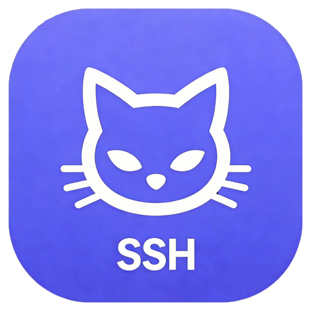
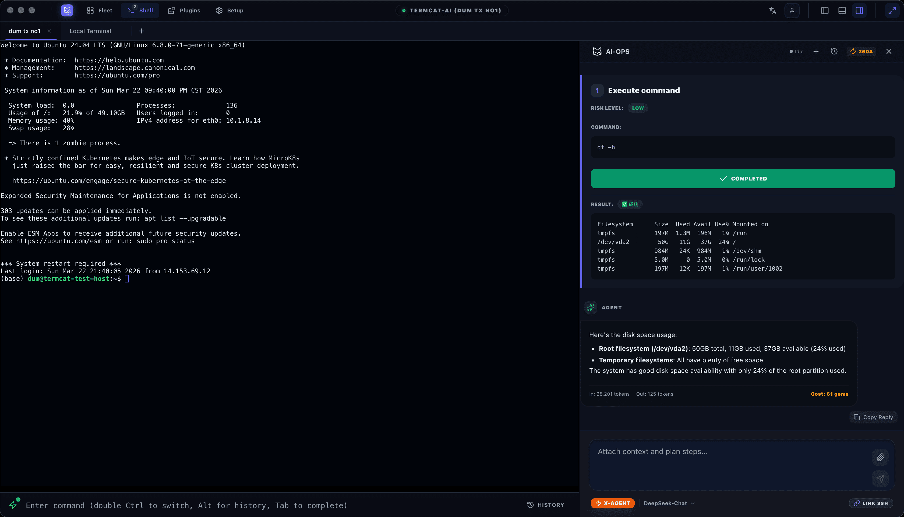
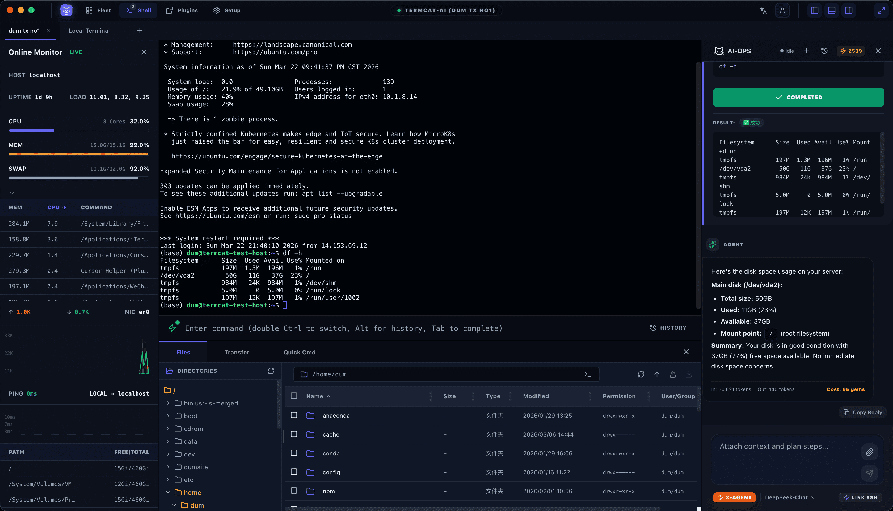

<p align="center">
  
</p>

<h1 align="center">TermCat</h1>

<p align="center">
  <b>AI 驱动的智能远程终端管理工具</b><br/>
  SSH 终端 &bull; 文件管理 &bull; 系统监控 &bull; AI 运维 &mdash; 一站式桌面应用
</p>

<p align="center">
  <a href="LICENSE"></a>
  
  
  
  
</p>

<p align="center">
  <a href="https://termcat.uniline.site">官网主页</a> &bull;
  <a href="README.md">English</a>
</p>

---

## 截图

<p align="center">
  
</p>

<p align="center">
  
</p>

## 功能特性

### 终端管理
- **多标签 SSH 终端** — 同时连接多台服务器，标签切换（不重新挂载）
- **本地终端** — 内置本地 PTY 终端支持
- **SFTP 文件浏览器** — 可视化文件树，支持浏览、上传、下载、在线编辑远程文件
- **端口隧道** — 创建 SSH 端口转发隧道
- **代理支持** — SSH 连接支持 SOCKS5 / HTTP / HTTPS 代理

### AI 运维（3 种模式）
- **Normal 模式** — AI 问答、命令建议、一键执行
- **Advanced（Agent）模式** — 自动化多步任务规划与执行，支持错误恢复
- **Code 模式** — 集成 Claude Code SDK，支持工具权限控制、风险评估、交互式反馈循环

### 系统与体验
- **实时系统监控** — CPU、内存、磁盘、网络指标，带历史图表
- **插件系统** — 内置插件（AI 运维、文件浏览器、命令库、传输管理器、系统监控），可扩展架构
- **主题** — 5 种应用主题（dark / regular / dim / urban / light）+ 5 种终端主题
- **国际化** — 中文、英文、西班牙语
- **主机管理** — 本地存储 + 云端同步（登录后双向同步）
- **代码编辑器** — CodeMirror 6 多语言语法高亮

## 技术栈

| 层次 | 技术 |
|------|------|
| 桌面框架 | Electron 28（Main + Renderer + Preload 三进程模型） |
| UI 框架 | React 18 + TypeScript 5 |
| 构建工具 | Vite 5 + vite-plugin-electron |
| 样式系统 | Tailwind CSS 3 |
| 终端渲染 | xterm.js（FitAddon / Unicode11Addon / WebLinksAddon） |
| SSH 连接 | ssh2（Node.js，Main 进程） |
| AI 通信 | WebSocket（连接 Agent Server） |
| 代码编辑 | CodeMirror 6 |
| 图标 | lucide-react |

## 架构概览

TermCat Client 遵循 Electron 三进程模型：

```
┌──────────────────────────────────────────┐
│         Main Process (Node.js)           │
│  ├── 窗口管理                             │
│  ├── SSH 连接服务                         │
│  ├── SFTP 文件传输                        │
│  ├── 端口隧道服务                         │
│  └── 本地 PTY 管理                        │
└──────────────┬───────────────────────────┘
               │ IPC (contextBridge)
┌──────────────▼───────────────────────────┐
│          Preload Script                  │
│  └── 安全 IPC 桥接                        │
└──────────────┬───────────────────────────┘
               │
┌──────────────▼───────────────────────────┐
│       Renderer Process (React)           │
│  ├── UI 组件（Dashboard / Terminal）      │
│  ├── 插件系统（内置插件）                  │
│  ├── AI Agent SDK（事件驱动）             │
│  ├── 服务层（API / Auth / SSH / Host）    │
│  └── 共享组件（MsgViewer）                │
└──────────────────────────────────────────┘
```

AI Agent SDK（`src/core/ai-agent/`）是独立的、无 UI 依赖的模块，可在 Electron 和 CLI 环境中复用。

## 环境要求

- **Node.js** >= 18
- **npm** >= 9
- **Python** >= 3.10（用于 `node-pty` 原生模块编译）
- 平台构建工具：
  - macOS：Xcode Command Line Tools
  - Windows：Visual Studio Build Tools（C++ 工作负载）
  - Linux：`build-essential`、`python3`

### 后端服务（必需）

TermCat Client 需要以下配套服务：

| 服务 | 默认端口 | 说明 |
|------|---------|------|
| `termcat_server` | 8080 | Go 后端 — API 网关、认证、主机同步、WebSocket 中转 |
| `termcat_agent_server` | 5001 | Python AI 代理 — 任务规划、命令生成、Code 模式 |

## 快速开始

### 1. 克隆仓库

```bash
git clone https://github.com/user/termcat.git
cd termcat/termcat_client
```

### 2. 安装依赖

```bash
npm install
```

### 3. 配置环境变量

```bash
cp .env.example .env.local
```

编辑 `.env.local`：

```env
VITE_API_BASE_URL=http://localhost:8080/api
VITE_WS_BASE_URL=ws://localhost:8080/ws
VITE_AI_WS_BASE_URL=ws://localhost:5001
```

### 4. 启动开发服务器

```bash
npm run dev
```

### 5. 构建生产版本

```bash
# macOS (x64)
npm run build:mac

# macOS (Apple Silicon)
npm run build:mac-arm64

# Windows
npm run build:win

# Linux
npm run build:linux
```

构建产物输出至 `release/` 目录。

## CLI Agent

TermCat 包含一个独立的 CLI 代理，用于在终端中进行 AI 运维：

```bash
# 交互模式
npm run cli

# 带参数运行
npx tsx src/core/ai-agent/cli/cli-agent.ts \
  --server http://localhost:8080 \
  --agent-server ws://localhost:5001 \
  --email user@example.com \
  --mode agent

# 自动执行模式（跳过确认）
npx tsx src/core/ai-agent/cli/cli-agent.ts --auto
```

CLI 命令：`/mode`、`/model`、`/auto`、`/stop`、`/status`、`/help`、`/quit`

## 项目结构

```
termcat_client/
├── src/
│   ├── base/              # 基础设施（国际化、日志、HTTP）
│   ├── core/              # 核心服务与业务逻辑
│   │   ├── ai-agent/      # AI Agent SDK（独立模块）
│   │   ├── ssh/           # SSH 连接管理
│   │   ├── terminal/      # 终端抽象层
│   │   ├── transfer/      # 文件传输
│   │   ├── tunnel/        # 端口隧道
│   │   ├── monitor/       # 系统监控
│   │   ├── auth/          # 认证服务
│   │   ├── host/          # 主机管理
│   │   └── plugin/        # 插件服务
│   ├── features/          # 功能模块（UI + Hooks）
│   │   ├── dashboard/     # 主机管理仪表板
│   │   ├── terminal/      # 终端视图与组件
│   │   ├── settings/      # 设置页面
│   │   └── shared/        # 共享 UI 组件
│   ├── plugins/           # 插件系统
│   │   ├── builtin/       # 内置插件
│   │   │   ├── ai-ops/           # AI 运维面板
│   │   │   ├── file-browser/     # SFTP 文件浏览器
│   │   │   ├── command-library/  # 快捷命令库
│   │   │   ├── transfer-manager/ # 传输管理器
│   │   │   └── monitoring-sidebar/ # 系统监控
│   │   └── ui-contribution/      # UI 贡献点系统
│   ├── shared-components/ # 可复用 UI 组件
│   │   └── msg-viewer/    # 富消息展示控件（虚拟化列表）
│   ├── main/              # Electron 主进程
│   ├── preload/           # 预加载脚本
│   └── renderer/          # 渲染进程入口
├── assets/                # 静态资源与图标
└── package.json
```

## 参与贡献

欢迎贡献代码！请遵循以下规范：

1. Fork 本仓库
2. 创建功能分支（`git checkout -b feature/amazing-feature`）
3. 遵循现有代码风格（TypeScript 严格模式，函数式 React 组件）
4. 所有用户可见文本使用 i18n 键值（禁止硬编码字符串）
5. 跨进程通信使用安全 IPC 模式
6. 提交更改（`git commit -m 'Add amazing feature'`）
7. 推送分支（`git push origin feature/amazing-feature`）
8. 发起 Pull Request

### 代码规范

- TypeScript 严格类型标注（避免 `any`）
- 函数式组件 + Hooks
- 弹窗和非首屏视图必须懒加载（`React.lazy`）
- 高频事件处理（>10次/秒）必须使用 `requestAnimationFrame` 或 debounce
- 所有异步操作需要错误处理
- 日志统一使用 `logger`（禁止 `console.log`）

## 许可证

本项目基于 **GNU Affero General Public License v3.0 (AGPL-3.0)** 开源。

详见 [LICENSE](LICENSE) 文件，或阅读完整协议 [gnu.org/licenses/agpl-3.0](https://www.gnu.org/licenses/agpl-3.0.html)。

任何基于本软件的衍生作品或网络服务，均须以 AGPL-3.0 协议发布，并向通过网络与之交互的用户提供完整源代码。
